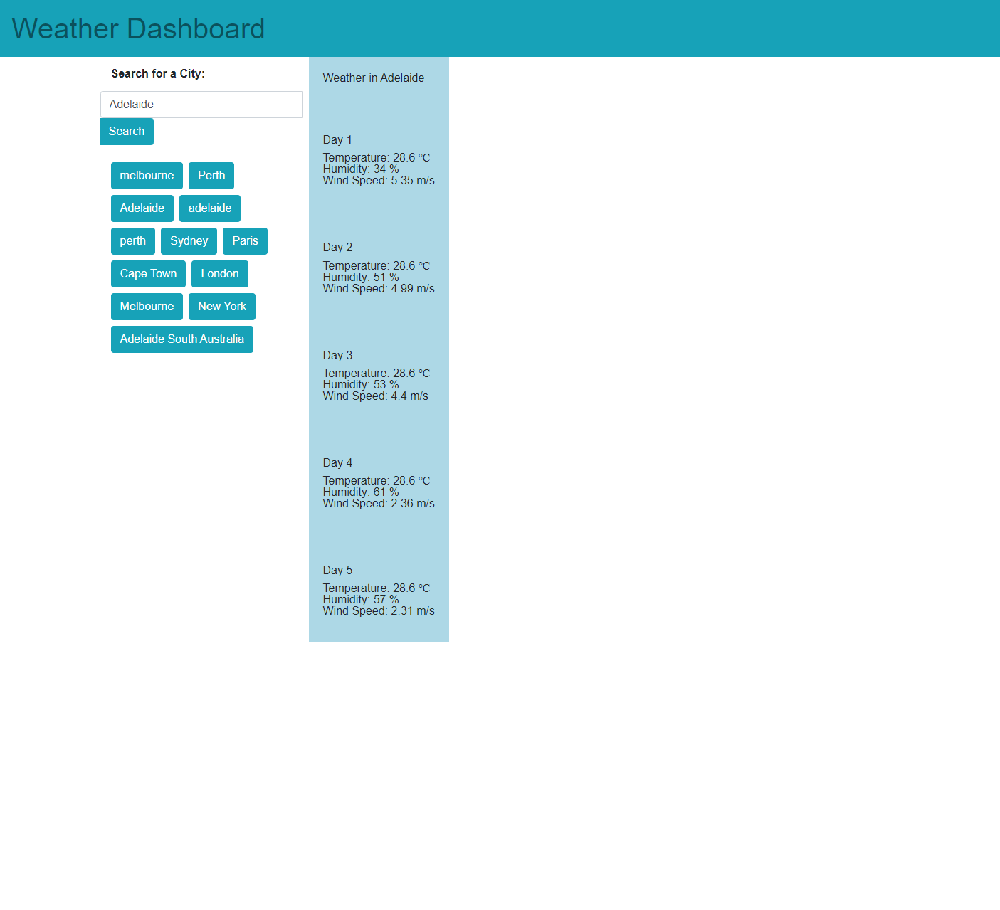

# Weather-Dashboard

## Technologies used

1. HTML
2. CSS
3. Bootstrap
4. JavaScript
5. Open Weather API

## Completed Webpage

## Link to website

1. GitHub Repository: https://https://github.com/Maxie92/Weather-Dashboard
2. Website: https://Maxie92.github.io/Weather-Dashboard/